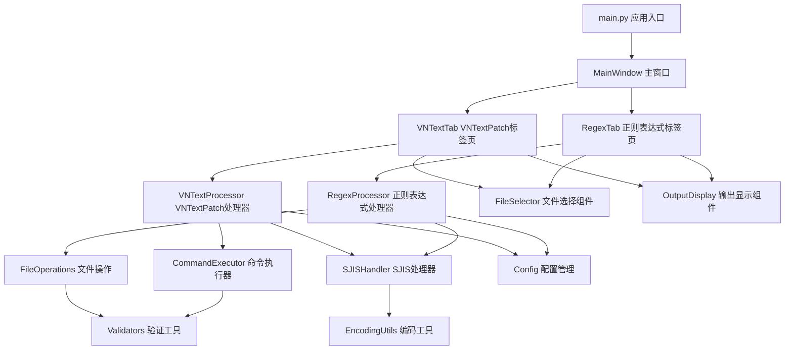
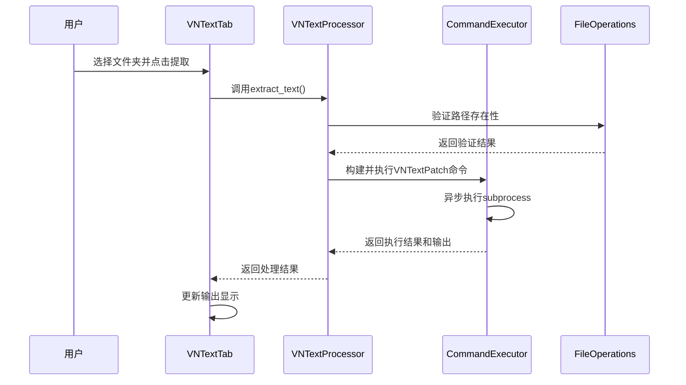
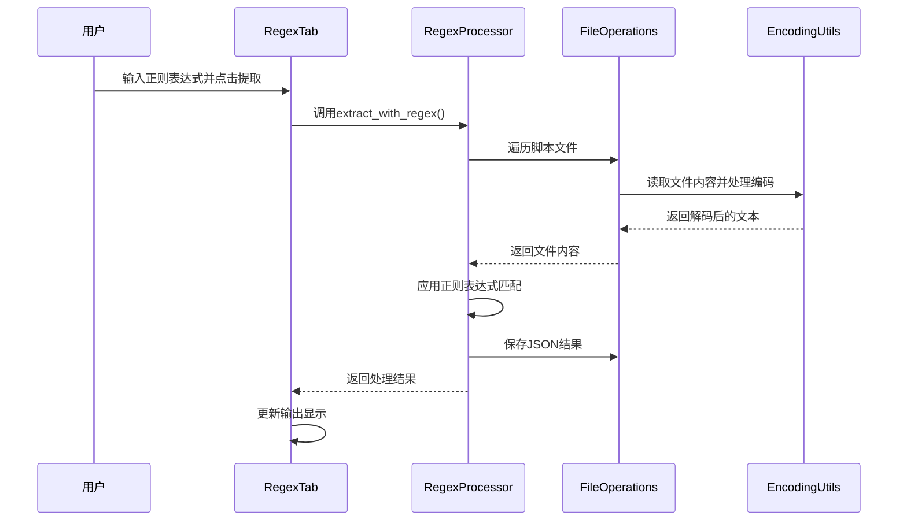

# GalTransl DumpInjector 项目重构设计

## 概述

本设计文档旨在将现有的单一文件Python应用程序重构为模块化、可维护的项目结构。当前项目是一个用于游戏翻译文本提取和注入的GUI工具，所有功能都集中在单个685行的Python文件中，导致代码维护困难、职责不清晰。

### 项目价值
- 提高代码可维护性和可扩展性
- 分离关注点，实现单一职责原则
- 便于单元测试和调试
- 为未来功能扩展提供良好基础

### 重构目标
- 将单体应用分解为多个功能模块
- 建立清晰的项目目录结构
- 分离GUI逻辑与业务逻辑
- 提供配置管理和错误处理机制

## 技术栈与依赖

| 组件 | 技术选择 | 说明 |
|------|----------|------|
| GUI框架 | tkinter + ttkbootstrap | 保持现有技术栈，提供现代化界面 |
| 配置管理 | configparser | Python标准库，处理INI配置文件 |
| 文本处理 | re + json | 正则表达式和JSON处理 |
| 文件操作 | os + shutil | 文件系统操作 |
| 进程调用 | subprocess | 调用外部VNTextPatch工具 |
| 编码处理 | struct | 处理二进制文件和字符编码 |

## 项目架构

### 目录结构设计

```
GalTransl_DumpInjector/
├── src/
│   ├── __init__.py
│   ├── main.py                    # 应用入口点
│   ├── gui/
│   │   ├── __init__.py
│   │   ├── main_window.py         # 主窗口控制器
│   │   ├── vntext_tab.py          # VNTextPatch模式标签页
│   │   ├── regex_tab.py           # 正则表达式模式标签页
│   │   └── widgets/
│   │       ├── __init__.py
│   │       ├── file_selector.py   # 文件/文件夹选择组件
│   │       └── output_display.py  # 输出结果显示组件
│   ├── core/
│   │   ├── __init__.py
│   │   ├── vntext_processor.py    # VNTextPatch处理器
│   │   ├── regex_processor.py     # 正则表达式处理器
│   │   ├── sjis_handler.py        # SJIS字符替换处理
│   │   └── file_operations.py     # 文件操作工具
│   ├── models/
│   │   ├── __init__.py
│   │   ├── config.py              # 配置数据模型
│   │   └── translation_data.py    # 翻译数据模型
│   └── utils/
│       ├── __init__.py
│       ├── encoding_utils.py      # 编码转换工具
│       ├── command_executor.py    # 命令执行工具
│       └── validators.py          # 输入验证工具
├── config/
│   └── default_config.ini         # 默认配置文件
├── resources/
│   └── hanzi2kanji_table.txt      # 汉字到日文汉字映射表
├── tests/
│   ├── __init__.py
│   ├── test_vntext_processor.py
│   ├── test_regex_processor.py
│   └── test_sjis_handler.py
├── requirements.txt               # 依赖管理
├── setup.py                      # 安装脚本
└── README.md                     # 项目说明
```

### 组件架构



## 核心功能模块设计

### GUI层架构

#### MainWindow 主窗口控制器
- **职责**: 管理主窗口布局和标签页切换
- **功能**: 
  - 初始化ttkbootstrap主题
  - 创建并管理标签页组件
  - 处理窗口关闭事件并保存配置
  - 加载应用配置

#### VNTextTab VNTextPatch模式标签页
- **职责**: VNTextPatch模式的用户界面逻辑
- **功能**:
  - 文件夹路径选择界面
  - 引擎选择下拉框
  - 编码选项复选框
  - 提取和注入操作按钮
  - 与VNTextProcessor的交互

#### RegexTab 正则表达式模式标签页
- **职责**: 正则表达式模式的用户界面逻辑
- **功能**:
  - 正则表达式输入框
  - 编码选择下拉框
  - 文件路径选择
  - 与RegexProcessor的交互

### 核心业务层架构

#### VNTextProcessor VNTextPatch处理器
- **职责**: 处理VNTextPatch模式的核心业务逻辑
- **接口定义**:

| 方法 | 参数 | 返回值 | 说明 |
|------|------|--------|------|
| extract_text | script_folder, json_folder, engine | ExecutionResult | 提取文本到JSON |
| inject_text | script_folder, json_folder, output_folder, options | ExecutionResult | 注入JSON到脚本 |
| validate_paths | paths_dict | ValidationResult | 验证路径有效性 |

#### RegexProcessor 正则表达式处理器
- **职责**: 处理正则表达式模式的文本提取和注入
- **接口定义**:

| 方法 | 参数 | 返回值 | 说明 |
|------|------|--------|------|
| extract_with_regex | script_folder, json_folder, message_pattern, name_pattern, encoding | ProcessResult | 使用正则提取文本 |
| inject_with_regex | script_folder, json_folders, output_folder, patterns, encodings | ProcessResult | 使用正则注入文本 |
| validate_regex | pattern | ValidationResult | 验证正则表达式 |

#### SJISHandler SJIS字符替换处理器
- **职责**: 处理SJIS字符集替换逻辑
- **功能**:
  - 读取汉字到日文汉字映射表
  - 执行字符替换操作
  - 生成替换配置信息
  - 处理sjis_ext.bin文件

### 数据模型层

#### Config 配置数据模型
- **职责**: 管理应用配置数据
- **属性**:
  - 文件夹路径配置
  - 编码设置
  - 正则表达式模式
  - 界面主题设置

#### TranslationData 翻译数据模型
- **职责**: 表示翻译数据结构
- **属性**:
  - 消息内容
  - 人名信息
  - 源语言和目标语言
  - 位置信息

### 工具层架构

#### CommandExecutor 命令执行工具
- **职责**: 安全执行外部命令并处理输出
- **功能**:
  - 异步执行subprocess命令
  - 实时输出流处理
  - 错误信息收集
  - 命令执行状态管理

#### FileOperations 文件操作工具
- **职责**: 封装文件系统操作
- **功能**:
  - 安全的文件读写
  - 目录创建和管理
  - 文件复制和移动
  - 路径验证

#### EncodingUtils 编码转换工具
- **职责**: 处理各种字符编码转换
- **功能**:
  - 自动检测文件编码
  - 编码转换操作
  - SJIS扩展字符处理
  - 二进制文件解析

## 数据流设计

### VNTextPatch模式数据流



### 正则表达式模式数据流



## 测试架构

### 单元测试策略

| 测试模块 | 覆盖范围 | 测试重点 |
|----------|----------|----------|
| test_vntext_processor | VNTextProcessor类 | 命令构建、路径验证、错误处理 |
| test_regex_processor | RegexProcessor类 | 正则匹配、文件处理、编码转换 |
| test_sjis_handler | SJISHandler类 | 字符映射、文件替换、配置生成 |
| test_file_operations | FileOperations类 | 文件操作、目录管理、异常处理 |
| test_encoding_utils | EncodingUtils类 | 编码检测、字符转换、二进制处理 |

### 测试数据准备
- 创建测试用的脚本文件样本
- 准备各种编码格式的测试文件
- 模拟VNTextPatch工具的输出结果
- 构建异常场景的测试用例

## 错误处理机制

### 异常分类与处理

| 异常类型 | 处理策略 | 用户反馈 |
|----------|----------|----------|
| 文件路径不存在 | 验证器拦截 | 弹窗提示选择有效路径 |
| 编码解码错误 | 自动检测编码重试 | 提示检查文件编码设置 |
| 正则表达式语法错误 | 语法验证 | 高亮错误位置并提示 |
| 外部工具执行失败 | 捕获stderr输出 | 显示详细错误信息 |
| 配置文件损坏 | 使用默认配置 | 提示重置配置 |

### 日志记录策略
- 使用Python logging模块
- 记录关键操作和错误信息
- 支持不同日志级别配置
- 提供日志文件轮转机制

## 配置管理

### 配置文件结构

```ini
[Paths]
script_jp_folder = 
json_jp_folder = 
json_cn_folder = 
script_cn_folder = 

[RegexSettings]
message_regex = 
name_regex = 

[Encoding]
japanese_encoding = sjis
chinese_encoding = gbk

[UI]
theme = auto
window_size = 584x659

[Advanced]
sjis_replacement = false
gbk_encoding = false
```

### 配置加载优先级
1. 用户配置文件 (config/user_config.ini)
2. 默认配置文件 (config/default_config.ini)
3. 硬编码默认值

## 迁移策略

### 重构步骤

1. **第一阶段: 基础架构搭建**
   - 创建项目目录结构
   - 建立模块的基本框架
   - 迁移配置管理功能

2. **第二阶段: 核心业务逻辑迁移**
   - 提取VNTextProcessor业务逻辑
   - 迁移RegexProcessor功能
   - 实现SJISHandler模块

3. **第三阶段: GUI重构**
   - 分离GUI组件
   - 重构事件处理逻辑
   - 优化用户界面交互

4. **第四阶段: 测试与优化**
   - 编写单元测试
   - 性能优化
   - 错误处理完善

### 向后兼容性
- 保持现有配置文件格式兼容
- 维持相同的用户界面布局
- 确保功能行为一致性
- 提供平滑的升级路径

## 性能优化考虑

### 文件处理优化
- 大文件分块读取处理
- 异步文件操作
- 内存使用监控
- 临时文件清理机制

### GUI响应性优化
- 长时间操作使用多线程
- 进度条显示处理状态
- 实时输出流更新
- 界面冻结防护

## 扩展性设计

### 插件架构预留
- 定义处理器接口规范
- 支持自定义引擎扩展
- 提供配置项动态加载
- 预留第三方工具集成点

### 未来功能扩展点
- 批量处理模式
- 多语言界面支持
- 云端配置同步
- 翻译质量检查工具